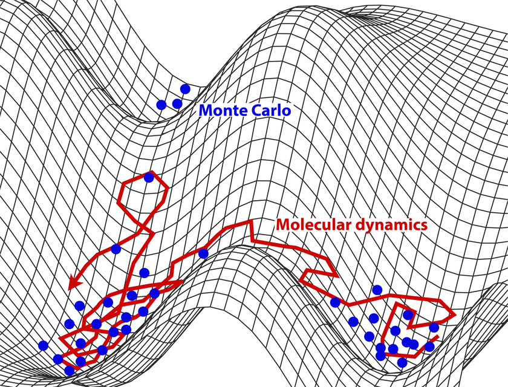

# Molecular dynamics calculations vs Monte Carlo simulations

|  Molecular Dynamics (MD)	| Monte Carlo (MC) 	|
|-	|-	|
| Provides information about dynamical behavior and equilibrium	|  Can only give static, equilibrium properties	|
|  Motions of particles (atoms, molecules) are natural following classical (Newtonian) mechanics	| Movements are artificial (random) 	|
|  	|  	|
|  	|  	|
|  	|  	|
|  	|  	|

Both can be used to produce thermodynamics properties.

Schematic representation of the sampling of the system's potential energy surface with molecular dynamics (in red) compared to Monte Carlo methods (in blue). ([Source](https://www.wikiwand.com/en/Molecular_dynamics))
